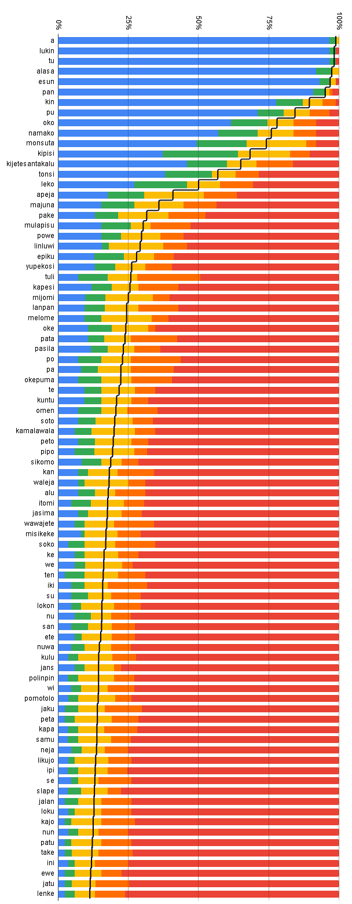

# 2020 Word Survey results (n = 86)

This was originally <a href="https://www.reddit.com/r/tokipona/comments/g9ne0s/survey_results_heres_how_real_these_tp_words_are/">uploaded to Reddit</a> on 2020-04-28.

<div align="center"></img></div>

## Full results

I (kala Asi) forgot to close this survey in 2020. The stats that I ended up generating (and pasting to Linku) were made a few days later, and as a result don't match the image precisely. (n = 104)

```
a               99
lukin           99
tu              99
alasa           97
esun            97
pan             96
kin             91
pu              82
oko             77
namako          74
monsuta         74
kipisi          68
kijetesantakalu 62
tonsi           57
leko            52
apeja           44
majuna          38
pake            34
mulapisu        32
linluwi         31
powe            31
kapesi          29
epiku           29
lanpan          28
pata            28
yupekosi        27
tuli            26
oke             25
pasila          25
melome          25
mijomi          25
po              25
te              22
kan             22
jasima          22
soto            22
okepuma         21
misikeke        21
pa              21
kuntu           21
kamalawala      21
peto            20
omen            19
pipo            19
sikomo          19
waleja          19
alu             18
ke              18
wawajete        18
soko            17
ete             17
itomi           17
samu            16
san             15
iki             15
lokon           15
ten             14
su              14
kulu            14
polinpin        14
jaku            14
pomotolo        14
nu              14
wi              14
kapa            13
jalan           13
peta            13
jans            13
likujo          13
nuwa            13
neja            13
ipi             13
loku            12
se              12
slape           12
nun             12
patu            12
kajo            12
lenke           12
jatu            11
take            11
ini             11
ewe             11
```
