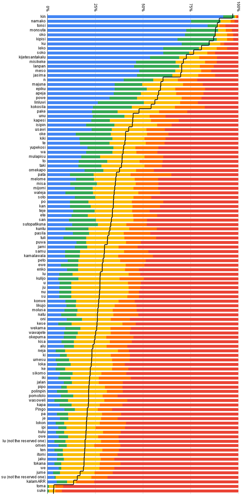
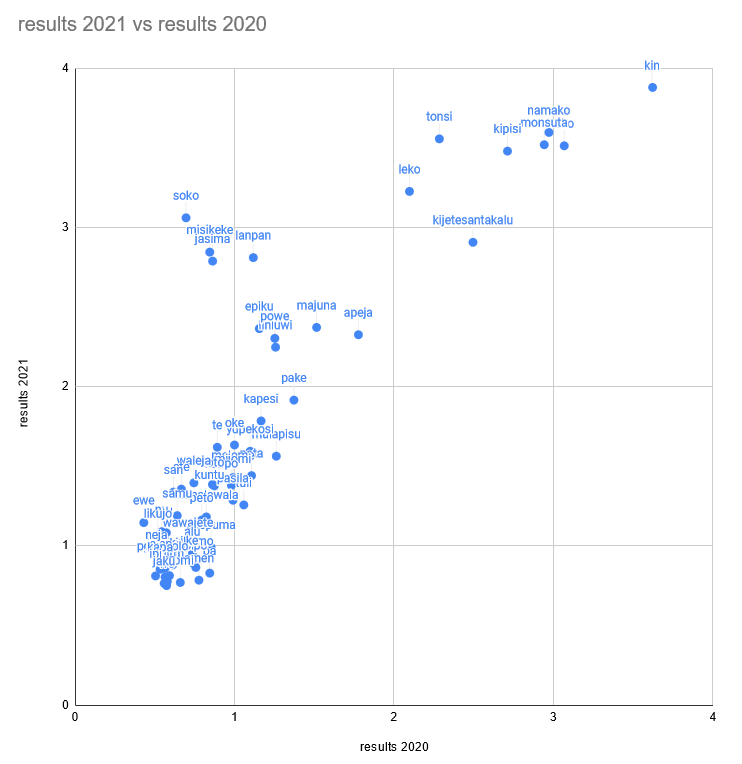

# 2021 Word Survey results (n = 152)

This was originally <a href="https://www.reddit.com/r/tokipona/comments/qa3inn/survey_results_heres_how_real_these_tp_words_are/">uploaded to Reddit</a> in <a href="https://www.reddit.com/r/tokipona/comments/qa3ksp/survey_comparison_how_real_these_tp_words_were/">two parts</a> on 2021-10-17.

<div align="center"></img></div>

<div align="center"></img></div>

## Full results

I (kala Asi) forgot to close this survey in 2021. The stats that I ended up generating (and pasting to Linku) were made a few days later, and as a result don't match the image precisely. (n = 171)
```
kin                       97
namako                    90
tonsi                     89
monsuta                   88
oko                       88
kipisi                    87
ku                        85
leko                      82
soko                      77
misikeke                  71
kijetesantakalu           71
lanpan                    71
meso                      71
jasima                    71
n                         60
majuna                    59
apeja                     59
epiku                     58
powe                      56
linluwi                   55
kokosila                  54
pake                      48
kapesi                    45
isipin                    43
unu                       43
usawi                     41
kiki                      41
oke                       40
te                        40
yupekosi                  40
wa                        39
mulapisu                  39
to                        38
taki                      38
omekapo                   38
pata                      36
melome                    36
mijomi                    35
misa                      35
soto                      34
po                        34
kan                       34
waleja                    34
teje                      34
san                       33
ete                       33
sutopatikuna              33
kuntu                     31
puwa                      31
pasila                    31
tuli                      31
jami                      29
kamalawala                29
samu                      29
lu                        29
su                        28
peto                      28
kulijo                    28
u                         28
ju                        28
ewe                       28
nu                        28
enko                      28
oni                       26
likujo                    25
kese                      25
konwe                     25
wekama                    25
molusa                    25
natu                      25
wawajete                  24
okepuma                   24
alu                       24
kisa                      24
ki                        23
umesu                     23
ke                        23
neja                      23
sikomo                    22
loka                      22
wasoweli                  22
pa                        21
polinpin                  21
pipo                      21
pomotolo                  21
iki                       21
je                        20
lokon                     20
Pingo                     20
jalan                     20
lu (not the reserved one) 20
owe                       20
kapa                      20
ten                       19
kulu                      19
omen                      19
ipi                       19
itomi                     19
we                        19
jaku                      18
tokana                    18
jume                      17
su (not the reserved one) 16
kalamARR                  13
toma                      3
suke                      3
```
