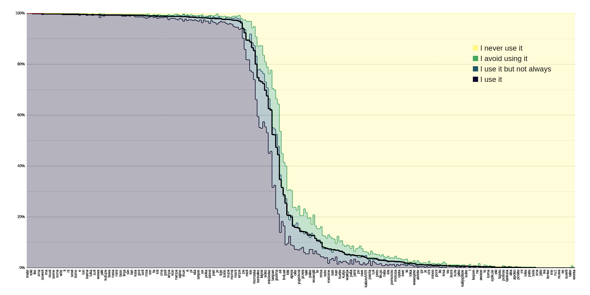
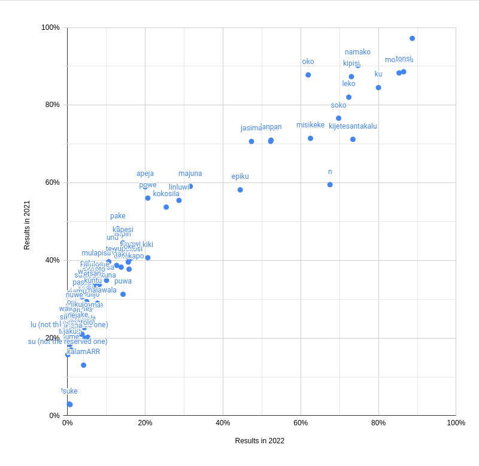
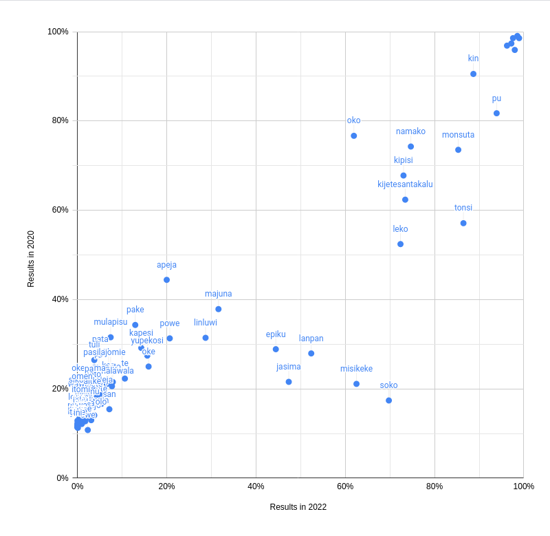

# 2022 Word Survey results (n = 345)

This was originally <a href="https://www.reddit.com/r/tokipona/comments/wqyczo/survey_results_how_many_people_use_words_in_2022/">uploaded to Reddit</a> on 2022-08-17.

## Graphs

Full results.

Blue to yellow represents the response types, from "I use it" to "I never use it".

The black line is the average response, aka "usage score".

<div align="center"></img></div>

A subsection of the graph above, zoomed into the bend.

<div align="center"></img></div>

Changes compared to last year (2021).

<div align="center"></img></div>

Changes compared to two years ago (2020).

<div align="center"></img></div>

3 more images are available in the repository. They present duplicate information (full results, changes), just in higher resolution.

## Methodology

Darn, this is the third year in a row ive made one of these.

I think the change of the main question (from "Do you think this is a real word?" to "Do you personally use this?") was a good choice. The original question got too close to "Do you recognise this word from dictionaries?", which led to a lot of unused words being fossilised as somehow relevant, and led to a feedback loop.

I went with "I use it but not always" and "I avoid using it" as the intermediate responses, for when you can't quite definitively say one way or the other. This is useful, for example, for joke words (obviously you aren't always going to be in a jokey mood to use one of those) or words youre interested in removing from your vocab.

I expected these intermediate options to behave like they exclusively fit between the "yes/no"s, in which case you can easily go from four values per word to just one (weighted sum). And to my eyes this does seem to be the case - there aren't that many interesting things to note about the intermediate options imo.

This year, I also included an option to, like, not reply to parts of the survey that I expect to be mostly "yes"es (pu) or "no"s (the "ku lili" / "none" blocks). I think it's a difficult balance between getting good data while also not scaring off responders. Next year I think I will expand the mandatory part to roughly 50ish words, which might cause some words to get higher results - more on that later.

## Trends

### pu

This is the first year that I've actually included all of pu in a poll! For good reasons, as I always expected it to be basically topped off at 100%. And yeah, that's almost true across the board. There are some interesting cases however:

```
esun            96%
pu              94%
ale             92%
meli            89%
mije            89%
```

Are the only pu words lower than 97%, and I think each has a good explanation. except for esun, I think that one is just situational enough that folks don't often feel like using it?

pu is a sort of "meta" word, it's highly useful to talk about toki pona in English, but it doesn't necessarily come up while casually using toki pona.

ale partially splits its score with ali.

meli and mije are gender words, and the gendern't nasin has got relatively popular.

### ku suli

ku suli has held up as a consistent category quite a bit more than I expected it to! Only one word actually fell below some ku lili words, and its kokosila at 25%.

```
kin             89%
tonsi           86%
monsuta         85%
ku              80%
namako          75%
kijetesantakalu 73%
kipisi          73%
leko            72%
soko            70%
n               68%
misikeke        63%
oko             62%
lanpan          52%
meso            52%
jasima          47%
epiku           44%
kokosila        25%
```

Nevertheless, it is pretty clear that rankings as far apart as 89% and 25% shouldn't be seen as a helpful grouping today.

### ku lili and onwards

This part is interesting to me, because filling out these sections was not mandatory. And yet, the rankings we got here are pretty meaningful! I would go as far as to say, even, theyre more meaningful than the previous "ku lili" vs "none" distinction that we had.

Can't say much more in here, because it's best to leave more thorough discussion for the next topic, which is

## Drawing new groups of words based on popularity of usage

I have decided to use this poll to separate toki pona words into new baskets, which I hope to make good use of in lipu Linku and ilo Linku, replacing the less useful book distinction we've been using thus far.

The categories I (having consulted with many members of the community) have drawn are:

1. **Core** - 118 pu words. Excludes meli, mije, ali, and of course anything ku suli.

2. **Widespread** - 11 words: meli, mije, kin, tonsi, monsuta, ku, namako, kijetesantakalu, kipisi, leko, soko.

3. **Common** - 5 words: n, misikeke, oko, lanpan, meso.

4. **Uncommon** - 9 words: jasima, epiku, ali, majuna, linluwi, kokosila, kiki, powe, apeja.

5. **Rare** - 16 words: usawi, oke, omekapo, yupekosi, kapesi, puwa, isipin, taki, nimisin, pake, wa, wuwojiti, unu, te, to, misa.

6. **Obscure** - everything else. Can't put a number on it, cause that includes anything beyond the poll as well, most likely.

The cutoff points are 90%, 70%, 50%, 20%, 10%. Cute round numbers weren't my main focus (more so grouping words into meaningful and useful clusters), but it worked out.

These categories will at some point become available on lipu Linku, most likely replacing the existing filtering by book.

## Which words over/underperformed?

It's actually hard to know because of the change in methodology. But you can get a glance by looking at the year-on-year comparisons, and seeing if a word is above or below the trendline (note: you will have to imagine the trendline yourself, cause I couldn't be arsed drawing one). If it's below (like puwa, n or kijetesantakalu), it has improved, relatively speaking.

## Random tidbits

There was a sneaky fake word in the poll! `lipasa`, as far as I've been able to see, has never been coined for any purpose, and I've been using it as a way to catch people who respond to the poll in a meaningless way. I've removed two responses based on this - though to be fair, both of those responses were just filled out as using every word.

The border between rare and obscure categories has been unusually stable as the responses kept coming in. Like, there was nothing in the design of the poll that helped respondents to separate the two, but a group of words just consistently did significantly better, ending up in the 10-20% range. Listing them as a single category will surely come in handy next year.

## Full results

### core

```
mute            100%
pona            100%
toki            100%
ala             100%
ike             100%
ilo             100%
sina            100%
tenpo           100%
soweli          100%
lili            100%
ma              100%
moku            100%
musi            100%
pilin           100%
seme            100%
sitelen         100%
sona            100%
suwi            100%
wile            100%
lape            100%
li              100%
mi              100%
ni              100%
o               100%
sewi            100%
telo            100%
tomo            100%
wan             100%
e               100%
la              100%
lon             100%
pakala          100%
kama            99%
ken             99%
luka            99%
mama            99%
suli            99%
utala           99%
wawa            99%
ijo             99%
jaki            99%
jan             99%
kulupu          99%
kute            99%
lawa            99%
lipu            99%
nasa            99%
nasin           99%
nimi            99%
sike            99%
taso            99%
kalama          99%
linja           99%
olin            99%
sin             99%
suno            99%
tan             99%
tawa            99%
kala            99%
pana            99%
pini            99%
sama            99%
seli            99%
kiwen           99%
insa            99%
kepeken         99%
len             99%
pimeja          99%
tu              99%
waso            99%
kili            99%
moli            99%
ona             99%
open            99%
pali            99%
poki            99%
anpa            99%
kasi            99%
kon             99%
kule            99%
nanpa           99%
palisa          99%
sijelo          99%
ante            99%
mun             99%
weka            99%
a               99%
awen            98%
pi              98%
pipi            98%
uta             98%
noka            98%
sinpin          98%
walo            98%
en              98%
lete            98%
poka            98%
lupa            98%
akesi           98%
jelo            98%
pan             98%
anu             98%
jo              98%
ko              98%
loje            98%
laso            98%
lukin           98%
selo            98%
supa            98%
nena            97%
monsi           97%
alasa           97%
mani            97%
mu              97%
unpa            97%
esun            96%
pu              94%
ale             92%
```

### widespread

```
meli            89%
mije            89%
kin             89%
tonsi           86%
monsuta         85%
ku              80%
namako          75%
kijetesantakalu 73%
kipisi          73%
leko            72%
soko            70%
```

### common

```
n               68%
misikeke        63%
oko             62%
lanpan          52%
meso            52%
```

### uncommon

```
jasima          47%
epiku           44%
ali             35%
majuna          32%
linluwi         29%
kokosila        25%
kiki            21%
powe            21%
apeja           20%
```

### rare

```
usawi           16%
oke             16%
omekapo         16%
yupekosi        16%
kapesi          14%
puwa            14%
isipin          14%
taki            14%
nimisin         13%
pake            13%
wa              13%
wuwojiti        13%
unu             12%
te              11%
to              11%
misa            10%
```

### obscure

```
teje            8%
soto            8%
kamalawala      8%
melome          7%
mulapisu        7%
san             7%
sutopatikuna    7%
kan             7%
mijomi          7%
kuntu           7%
konwe           6%
kulijo          6%
ete             5%
waleja          5%
Pingo           5%
pata            5%
wekama          5%
jami            5%
nja             5%
po              5%
omekalike       5%
owe             5%
ke              4%
kalamARR        4%
enko            4%
pasila          4%
polinpin        4%
tuli            4%
kese            4%
peto            3%
yutu            3%
likujo          3%
wasoweli        3%
natu            3%
jonke           3%
alu             3%
pa              3%
pomotolo        3%
samu            3%
molusa          3%
okepuma         3%
ojuta           2%
pika            2%
ewe             2%
umesu           2%
ki              2%
kapa            2%
loka            2%
neja            2%
wawajete        2%
lu              1%
alente          1%
jans            1%
ipi             1%
peta            1%
je              1%
oki             1%
oni             1%
u               1%
omen            1%
pipo            1%
poni            1%
sikomo          1%
iki             1%
jume            1%
kisa            1%
slape           1%
su              1%
ten             1%
itomi           1%
jalan           1%
kulu            1%
nele            1%
jaku            1%
jule            1%
kalijopilale    1%
kosan           1%
suke            1%
we              1%
i               1%
ju              1%
kepen           1%
nalanja         1%
nu              1%
tokana          1%
awase           0%
kutopoma        0%
lo              0%
papa            0%
toma            0%
wi              0%
epikule         0%
lisa            0%
eki             0%
konsi           0%
lajotu          0%
lijokuku        0%
potesu          0%
saja            0%
tankala         0%
wisa            0%
aka             0%
ako             0%
apoko           0%
lokon           0%
positu          0%
sipi            0%
ini             0%
kewi            0%
loku            0%
opasan          0%
patu            0%
pela            0%
salu            0%
su1             0%
ana             0%
api             0%
jatu            0%
jumi            0%
ka              0%
kajo            0%
lenke           0%
lipasa          0%
me              0%
mison           0%
nu1             0%
nun             0%
nuwa            0%
pe              0%
se              0%
sen             0%
suwili          0%
ta              0%
take            0%
waken           0%
wenta           0%
```
