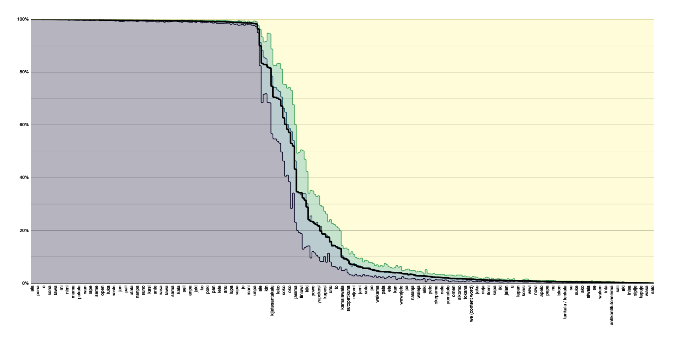
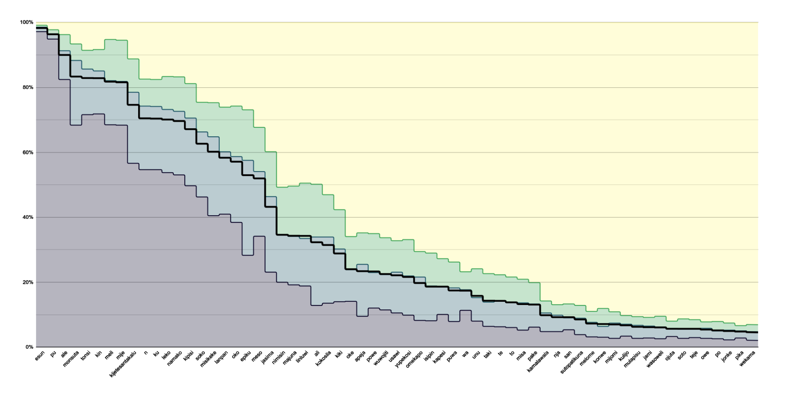
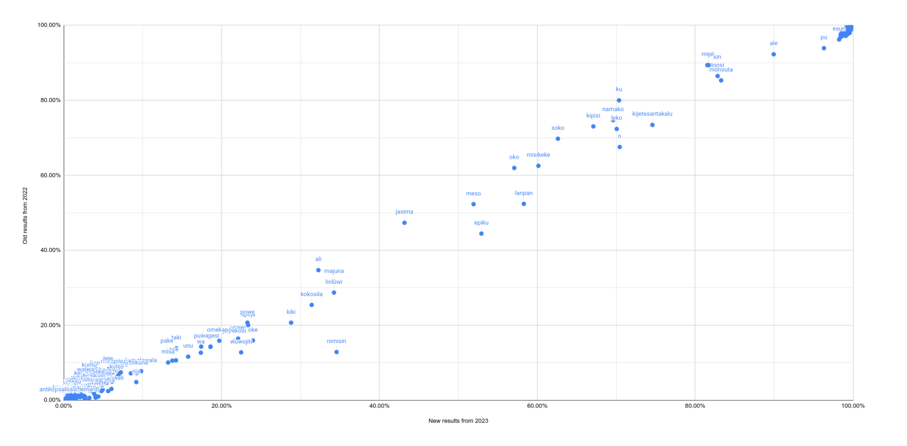
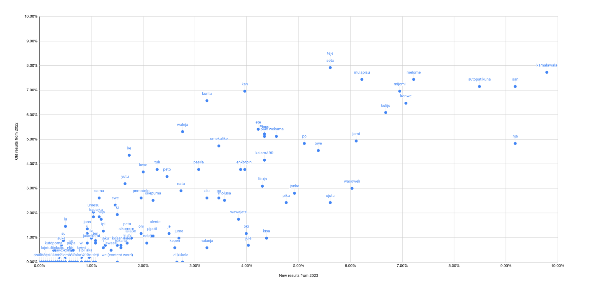
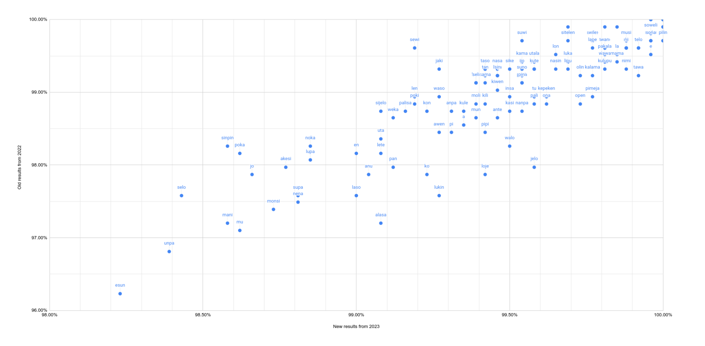
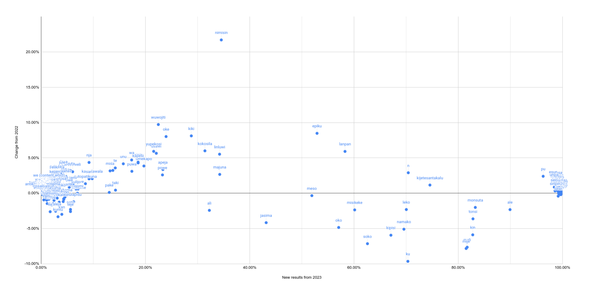

# 2023 Word Survey results (n = 868)

## Methodology

Compared to last year, we have changed how the words are grouped on the survey page, making use of 6 categories (from "core" to "obscure") we made using last year's survey. This let us focus on the 10-90% range, where the most variation occurs.

## Observations

868 respondees is *a lot*. The opportunity for further coverage growth is limited.

The act of making uncommon+rare (previously largely ku lili) words obligatory to answer made them more discoverable to respondees, accounting for a ~5% increase across the board in that category.

Obscure+undocumented words have had a hard time mixing with obligatory responses. There's an artificial gap between pake (13%) and kamalawala (10%). The ability to skip sections, plus the sheer amount of dead-ish words in "obscure", made replying to this section unappealing to enough people to create a gap.

The ability to skip sections also explains why core words are considerably squished compared to last year.

ale (without ali) dropped from 92% to 90%. There is possibility of ale dropping below 90% some time in the future. While this represents the reality of ale-users vs ali-users, this would be misleading to those dictionary users who only look at core words, and would see neither. We should rework the dictionary/survey to list alternate spellings as a single entry. Polling ale vs ali should still be done, just not in this direct form.

Only 3 (out of 63) previously undocumented words made it in. On the other hand, old words aren't really decaying below 1%. This is an indication we are not good enough at selecting new words to show in the survey.

I've unfortunately forgot to include a fake word in the poll this time round.

## Highlights

### Ascending categories

common -> widespread: **n**
uncommon -> common: **epiku**
rare -> uncommon: **nimisin, oke, usawi, wuwojiti, yupekosi, omekapo**
obscure -> rare: **kamalawala**
new: **eliki, pakola, we (content word)**

### Descending categories

widespread -> common: **kipisi, soko**
obscure -> no longer notable: **aka, awase, eki, ewe, i, iki, ipi, itomi, jaku, jalan, jans, kapa, konsi, lo, loka, lokon, neja, samu, sipi, ten, umesu, wi, ako, kutopoma, lijokuku, suke, toma**

## Cool graphs

Full results, sorted from core to obscure.

Blue to yellow represents the response types, from "I use it" to "I never use it".

The black line is the average response, aka "usage score".

<div align="center"></img></div>

A subsection of the graph above, zoomed into the bend.

<div align="center"></img></div>

A comparison of 2023 results vs 2022 results. Overperforming words will be below the trend line, underperformers are above.

<div align="center"></img></div>

Zoomed into obscure words.

<div align="center"></img></div>

Zoomed into core words.

<div align="center"></img></div>

Changes compared to last year.

<div align="center"></img></div>


## Full results

### Core words (90-100%)

118 words:

```
ala      100%
e        100%
ijo      100%
ike      100%
ilo      100%
insa     100%
jan      100%
jelo     100%
kalama   100%
kama     100%
kasi     100%
ken      100%
kepeken  100%
kulupu   100%
kute     100%
la       100%
lape     100%
li       100%
lili     100%
lipu     100%
lon      100%
luka     100%
ma       100%
mama     100%
mi       100%
moku     100%
musi     100%
mute     100%
nanpa    100%
nasin    100%
ni       100%
nimi     100%
o        100%
olin     100%
ona      100%
open     100%
pakala   100%
pali     100%
pana     100%
pilin    100%
pimeja   100%
pini     100%
pona     100%
seme     100%
sike     100%
sina     100%
sitelen  100%
sona     100%
soweli   100%
suli     100%
suno     100%
suwi     100%
tawa     100%
telo     100%
tenpo    100%
toki     100%
tomo     100%
tu       100%
utala    100%
walo     100%
wan      100%
wawa     100%
wile     100%
a        99%
akesi    99%
alasa    99%
anpa     99%
ante     99%
anu      99%
awen     99%
en       99%
jaki     99%
jo       99%
kala     99%
kili     99%
kiwen    99%
ko       99%
kon      99%
kule     99%
laso     99%
lawa     99%
len      99%
lete     99%
linja    99%
loje     99%
lukin    99%
lupa     99%
mani     99%
moli     99%
monsi    99%
mu       99%
mun      99%
nasa     99%
nena     99%
noka     99%
palisa   99%
pan      99%
pi       99%
pipi     99%
poka     99%
poki     99%
sama     99%
seli     99%
sewi     99%
sijelo   99%
sin      99%
sinpin   99%
supa     99%
tan      99%
taso     99%
uta      99%
waso     99%
weka     99%
esun     98%
selo     98%
unpa     98%
pu       96%
ale      90%
```

### Widespread words (70-90%)

10 words:

```
kin              83%
monsuta          83%
tonsi            83%
meli             82%
mije             82%
kijetesantakalu  75%
ku               70%
leko             70%
n                70% (up from common)
namako           70%
```

### Common words (50-70%)

7 words:

```
kipisi    67% (down from widespread)
soko      63% (down from widespread)
misikeke  60%
lanpan    58%
oko       57%
epiku     53% (up from common)
meso      52%
```

### Uncommon words (20-50%)

14 words:

```
jasima    43%
nimisin   35% (up from rare)
linluwi   34%
majuna    34%
ali       32%
kokosila  31%
kiki      29%
oke       24% (up from rare)
apeja     23%
powe      23%
usawi     22% (up from rare)
wuwojiti  22% (up from rare)
yupekosi  22% (up from rare)
omekapo   20% (up from rare)
```

### Rare words (10-20%)

11 words:

```
isipin      19%
kapesi      19%
puwa        17%
wa          17%
unu         16%
taki        14%
te          14%
to          14%
misa        13%
pake        13%
kamalawala  10% (up from obscure)
```

### Obscure words, high end (>=5%)

18 words:

```
nja           9%
san           9%
sutopatikuna  8%
konwe         7%
kulijo        7%
melome        7%
mijomi        7%
jami          6%
mulapisu      6%
ojuta         6%
soto          6%
teje          6%
wasoweli      6%
jonke         5%
owe           5%
pika          5%
po            5%
wekama        5%
```

### Obscure words, low end (<5%)

48 words:

```
enko               4%
ete                4%
jule               4%
kalamARR           4%
kan                4%
kisa               4%
likujo             4%
molusa             4%
oki                4%
pata               4%
Pingo              4%
polinpin           4%
wawajete           4%
alu                3%
eliki              3% (new)
je                 3%
jume               3%
kepen              3%
kuntu              3%
nalanja            3%
natu               3%
omekalike          3%
pa                 3%
pakola             3% (new)
pasila             3%
waleja             3%
alente             2%
kalijopilale       2%
ke                 2%
kese               2%
ki                 2%
kosan              2%
kulu               2%
nele               2%
okepuma            2%
omen               2%
oni                2%
peta               2%
peto               2%
pipo               2%
pomotolo           2%
poni               2%
sikomo             2%
slape              2%
tokana             2%
tuli               2%
we (content word)  2% (new)
yutu               2%
```

### Not notable for inclusion in the dictionary (<2%)

93 words:

```
aka, aki, ako, aku, aleta, an, anta, antikontitutonelema, apelo, api, apowesi, asen, ata, awa, awase, eki, enepi, ewe, i, iki, inisa, inta, ipi, itomi, jaku, jalan, jans, ju, kalapisituji, kana, kapa, kasan, kikolo, kikulo, kokoliko, konsi, konsuno, kosikosa, kutopoma, lajotu, lapan, lijokuku, likono, lo, loka, lokon, lose, lu, mamasi, masalo, matu, nali, ne, neja, nowi, nu, olala, onono, otomalasi, panke, papa, pataka, pipolo, sali, salo, samu, sapelipope, se, si\i\ilapa, sikako, sipi, sipije, siwala, sole, su, suke, ta, tankala / tenkala, tapuje, teken, teki, ten, toma, tona, towoki, u, ulu, umesu, waken, wasa, we (particle), wi, wiwi
```
