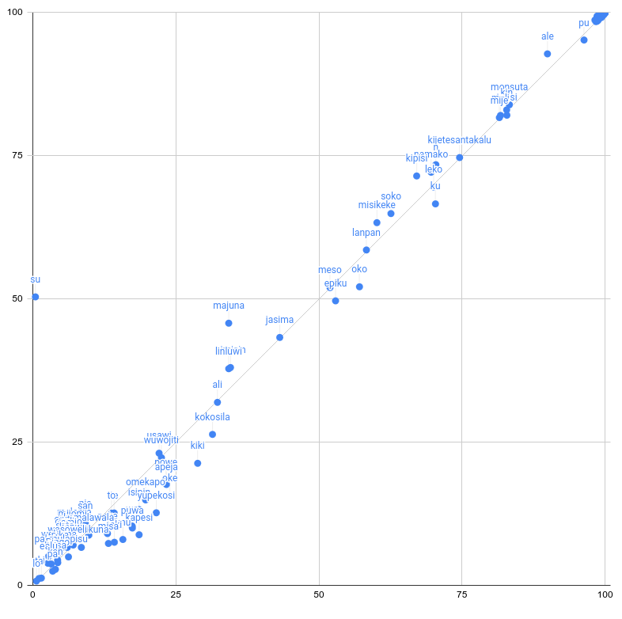
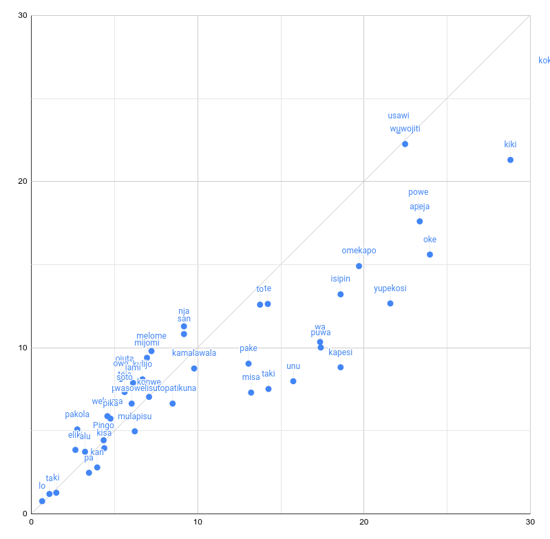
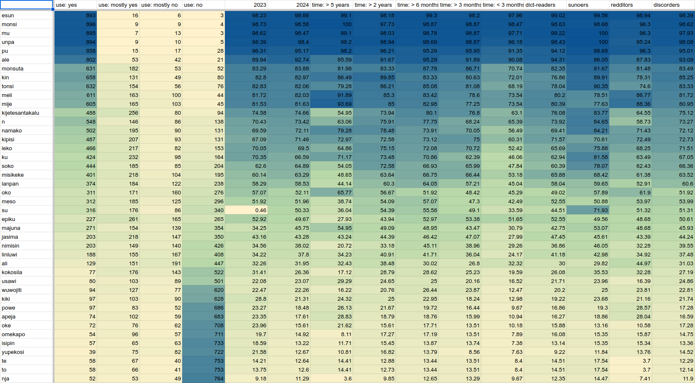
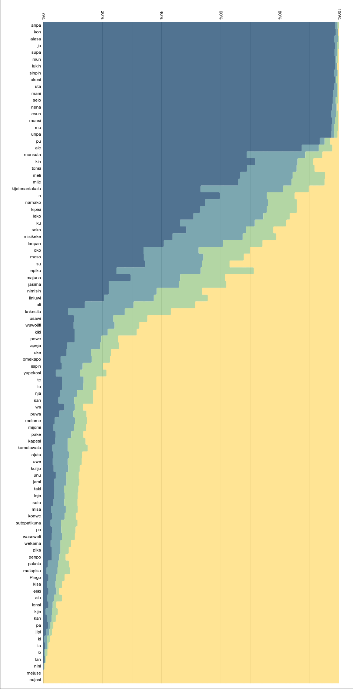

# 2024 Word Survey results (n = 918)

## Methodology

In the unlikely case you're reading every survey result page in order, as opposed to just being a community member in 2024, you might want to know that in February-March 2024 the community [reached a consensus](https://sona.pona.la/wiki/Usage_categories#Table_of_categories) to change the number of categories from 6 to 4, and in April 2024 we split off words we consider effectively dead/unused (<5%) into the Linku Sandbox. Also, in August 2024 [ilo Muni](https://gregdan3.github.io/ilo-muni/) was launched, giving us a different approach to measuring word use (via corpus search instead of self-reporting).

From now on, Sandbox words will not be polled unless we see a reason to poll them, such as if we see the usage uptick in ilo Muni. As such, only 18 Sandbox words were polled, reducing the total poll length by more than a hundred entries. This has the obvious upside of reducing surveyee fatigue, but any change to survey design naturally makes it a bit more difficult to compare results across years.

The survey now requires a Google account, which serves the double purpose of reducing spam (we filtered out 2 separate instances of spam in 2023) as well as providing everyone with a clean, permanent edit link.

## Number of respondents

918 respondents is only a slight bit higher than last year's 868, curbing our exponential growth from 2020 till 2023. In my opinion, this likely reflects our ability to reach out: 2020-2022 were mostly driven by me posting, whereas 2023 and 2024 involved essentially "administrative resource" in the form of @ everyone pings and dictionary webpage popups.

Alternative explanations include community fatigue (we overdid @ everyone pings this year, for which I'm sorry), or the Google account requirement turning down some percentage of respondents. I believe these factors probably didn't contribute as much.

## Mistakes

**usawi** was initially erroneously excluded from the poll. We added it in the obligatory section, and its score is calculated for n = 773.

**jonke** was also erroneously excluded, but we noticed too late to poll it, so its score won't be updated.

## Observations

Similar to 2023, the year on year comparison shows relatively little movement, much less than in prior years.

</img>

However, several noteworthy trends emerge:

* Most of the obscure words, especially those in the 10-30% range, have dropped significantly, in some cases almost halving their usage score. This is in line with a general understanding that some of these words (kapesi, unu, misa) have experienced their time in the limelight some years prior and are no longer picked up by newcomers.

* We get our first score for **su**, which came out in February 2024: 50%, putting it in the uncommon category. It was, in fact, already in uncommon, because we knew this word was an outlier and its category had to be updated relatively soon after release. We based our category assessment on a poll in #sona-kulupu in ma pona, which turned out to be close enough!

* barring su, **majuna** is the biggest outlier this year, going from 34% to 46%. This is likely caused by the community taking interest in jan Sonja's use of majuna in lipu su. However, the word has had other updates in recent years, such as kulupu kasi's new sitelen pona for majuna in the shape of a lotus.

* **kokosila** drops from 31% to 26%, weirdly reversing its movement from 2022-2023, and putting it into obscure. This was accompanied by the rise in popularity of **penpo**, a previously undocumented word meaning "(pi) toki pona taso", mostly in reference to tpt events in ma pona.

</img>

Last year's poll showed an artificial gap between rare words (then 10-30%) and obscure words (then 2-10%), caused by a ridiculously oversized obscure section. The introduction of the unpolled Sandbox has helped with this, and the gap is closed and the words on either side have mixed together.

## Demographic data

The data processing used to be written in shitty Google Sheets functions, but has now been rewritten in Python+pandas, giving us a nicer [data dump](scores-2024.csv) with a demographic data breakdown:

</img>

Here you can see some interesting trends between different demographic groups:

* Redditors tend to use words in a similar distribution to community members from 5+ years ago.

* Participants of [suno pi toki pona](https://suno.pona.la) might be in the forefront of changing word popularity, with mije/meli scoring lower than most other common words, and su at a staggering 72%. They also have a much higher usage score for penpo, at 16%.

* Beginners of under 3 months tend to know a lot fewer common and uncommon words than those under 6 months. **epiku** stands out as being unusually correlated with beginners and dropping off for long time users, and **ali** stays at a relatively steady 32%ish despite significantly losing ground to ale in corpus data since 2020.

## Intents for next year

</img>

Very few respondents actually take the time to think about core words, and this is a problem with our poll design. Next year we will try a different approach that will hopefully increase the number of careful responses to this section by a factor of about 2-3. Come next year to find out what it is!

## All category changes

uncommon -> obscure: **kokosila**

sandbox -> obscure: **penpo, pakola**

The full results are available as a [csv dump](scores-2024.csv), and results rounded to the nearest digit will be added to Linku.

## Extra graph

</img>

Full results, sorted from core to obscure.

Blue to yellow represents the response types, from "I use it" to "I never use it".

Honestly, this graph is not very insightful anymore, but it was nice to include it anyway.
