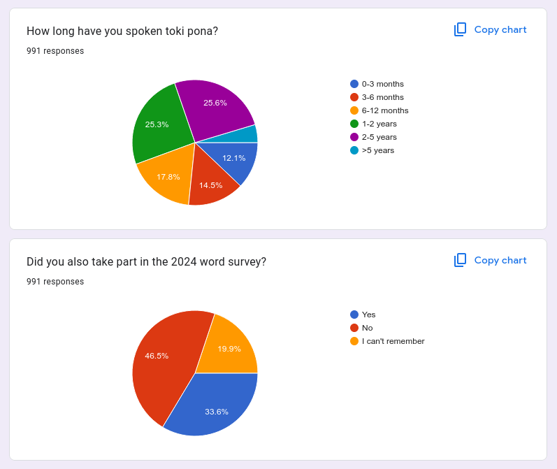
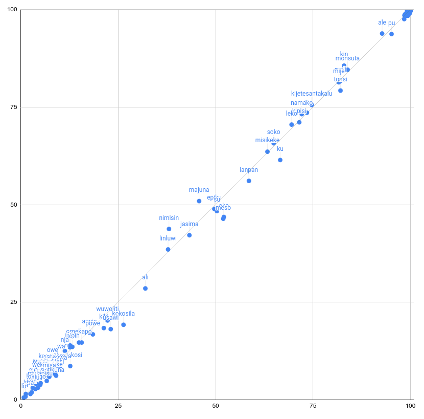
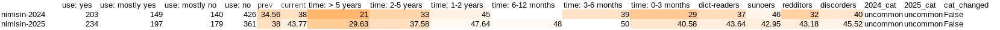

# 2025 Word Survey results (n = 971)

It's that time of year again where we present updated scores for Toki Pona words that tell us what percentage of Toki Pona speakers report using the word! This is the 6th time we conduct this poll, and every year it beats our expectations in two regards:
* The number of respondents keeps increasing! 800-1000 seems to be more or less a plateau, judging by the [past](https://github.com/lipu-linku/ijo/blob/main/survey/2024/README.md) [couple](https://github.com/lipu-linku/ijo/blob/main/survey/2023/README.md) survey results, but nevertheless the number goes up, if not as dramatically as it did in 2020-2023.
* The results become more and more underwhelming every time! Gone are the days when words would wildly swing year on year, swept up by whatever is trending on the Discord server. Nowadays, even a movement of ~5% is very noteworthy. This is a testament to how well established conventional Toki Pona is today compared to even just five years ago.

### So the number of respondents has plateaued and you get the sameish results every year. Is Toki Pona stagnating?

This worry is often on my mind, but here the survey actually offers us healthy signs:

</img>

Around half the respondents have only started learning in the past 12 months, and therefore obviously could not have answered last year's survey. This is comparable to last year.

On the flip side, this also means about half the people who replied last year did not do so this year. If we assume they did not magically unlearn all of Toki Pona, this means we are losing touch with some speakers. This is a fairly natural process in online communities (simply representing membership turnover), but it does create problems for those who wish to, for example, estimate the number of Toki Pona speakers. There are likely thousands of people of varying degrees of proficiency that we simply cannot reach en masse anymore.

Nonetheless, people who no longer publicly speak the language also no longer shape how it's used by others! And it's quite notable that despite this nearly 50% turnover rate year on year, reported community use has stabilised so much.

## Observations

In my past survey posts, I had included scatterplot graphs comparing the prior year's results to the then-up-to-date ones. Well, I'll do it this time as well for completeness' sake:

</img>

The graph above shows a comparison between 2025 scores (vertical) vs 2024 scores (horizontal). If a word is above the y = x line, its score has increased, if its below, it has gone down.

Most dots line up near the y = x line, meaning basically nothing has changed since last year. Let's instead look at the outliers:

### Biggest decreases (up to -1.5%):

| word         | decrease |
|--------------|----------|
| kokosila     | -7.14    |
| meso         | -5.58    |
| oko          | -5.25    |
| ku           | -5.14    |
| usawi        | -4.98    |
| yupekosi     | -4.05    |
| ali          | -3.42    |
| kiki         | -2.94    |
| pake         | -2.86    |
| tonsi        | -2.83    |
| lanpan       | -2.44    |
| puwa         | -2.06    |
| su           | -1.96    |
| kapesi       | -1.95    |
| wuwojiti     | -1.94    |
| sutopatikuna | -1.83    |
| powe         | -1.73    |

The list is topped by four words that are in some ways quite varied:

* **kokosila**, a tired joke;
* **meso**, a community addition that most people use fairly redundantly;
* **oko**, an old retention, slowly fading from the collective memory;
* **ku**, a regular word or a proper name? from community use it's not entirely clear.

Though the reasoning for why people may choose to avoid them is different in each case, they share a commonality: all are *nimi ku suli*, belonging to a higher-polling class of words from jan Sonja's 2020-2021 surveys, and highlighted as such in *lipu ku*. While it was certainly influential in 2021-2022, interest in the book (and its associated wordlist) has steadily faded. The word *ku* itself declined from 80% in 2022 to 61% 3 years later, putting it on track to move into the "uncommon" category next year.

Other decreases on the list are perhaps somewhat harder to explain. **ali**, **pake**, **kapesi**, **powe** are old words which have all shined in some ways in 2020-2021 literature (e.g. [tu kuntu](https://lipu.pona.la/2021/02/tu-kuntu/a)), but fell out of fashion. **yupekosi**, **sutopatikuna** are jokes from several years ago about coining words. It is words like **usawi**, **kiki**, and **puwa** that are most puzzling -- perhaps people just stopped experimenting with them.

### Biggest increases (up to +1.5%):

This list is quite a bit shorter:

| word    | increase |
|---------|----------|
| nimisin | 5.75     |
| majuna  | 5.16     |
| juna    | 2.81     |
| kin     | 2.68     |
| pata    | 1.89     |
| penpo   | 1.84     |
| owe     | 1.76     |

**nimisin** has only been in the survey since 2022, but has been rising consistently, now reaching 44%.

</img>

While it is tempting (and, honestly, *has* been tempting these past several years) to discount *nimisin* as "ugh, that wrong thing that new kids say", the year-on-year statistics actually show that long-time Toki Pona speakers are also much more readily adopting the word, even if they are lagging behind the average speaker. 21% -> 30% over one year is no joke.

**majuna** continues its trajectory from last year. It was featured in *lipu su*, and it is in good graces among most proficient Toki Pona speakers. Which of these factors, if not something else entirely, is causing it to rise? It's hard to say.

Fun fact, **jonke** also made this list at first, at 3.47%. The problem is... it was erroneously comparing against 0%, because last year I forgot to poll it. 3.47% is actually its entire score, which puts it in sandbox.

The same 0% explanation applies to *juna*, although this time on purpose. It, too, goes in sandbox, (where it was already residing).

## Caveats

### Core word overreporting

Last year we've identified an issue: core words are being overreported, particularly by beginners who haven't memorised the word list yet. They will typically skip the entire core section (which is enabled by survey design), moving on to the common words, reporting most of those relatively low because they haven't learned them yet. This creates an unnatural gap between "core" words like *selo, lupa* and "common" words like *kin, monsuta*, which are in reality likely used by a similar number of people.

We had a solution planned for this year: to ask each participant to respond to only a (semi-random) subsection of core words. This effectively increases sample size without exhausting people's patience on a hundred rows they're supposed to answer "yes" to anyway. Unfortunately for this project, this year I, kala Asi, was highly involved in running [suno pi toki pona](https://suno.pona.la/2025/), which required my full attention for weeks. I did not have the time to update the survey template with this change in mind, and the survey was actually entirely run by mun Kekan San (god bless him and his unusually high productivity). We will get better data next year, pinky promise.

### Sample size inconsistencies

The pie chart above comes straight from Google Forms. You might notice it has a slightly different sample size because:

* We actually had 2 forms set up -- one for the wider audience, making use of Google's authentication for two features: (a) one response per person, (b) nice clean edit links. The second form was distributed privately upon request, with authentication turned off. The latter received 8 replies. Both are taken into account in the final dataset.
* We have removed 28(!) responses that failed to distinguish between real Toki Pona words and fake ones made up for the survey. They are included in the pie chart, but removed in the dataset as a later processing step. If you're curious what the discarded data looked like, it was largely noise. Among words that were part of the obligatory section, like *meli*, *kipisi*, *linluwi*, you would not find the expected gradient from most commonly used to least commonly used.

## Summary: all category changes

uncommon -> obscure: **ali**

obscure -> sandbox: **mulapisu, pakola, jonke**

No word went up a category this year.

The full results are available as a [csv dump](scores-2025.csv), and results rounded to the nearest digit will be added to Linku.
