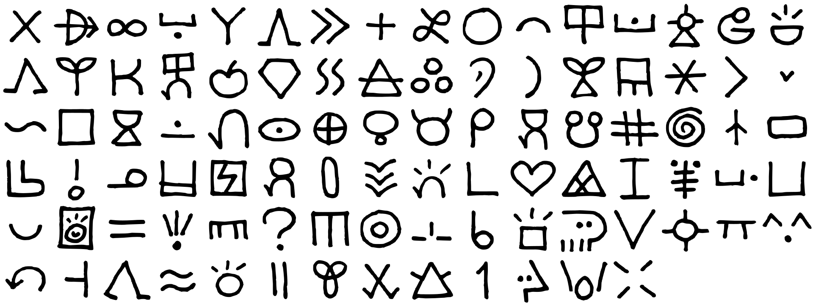
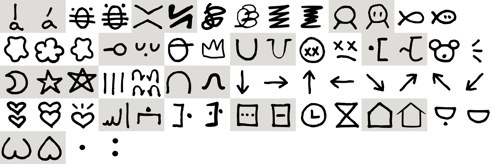
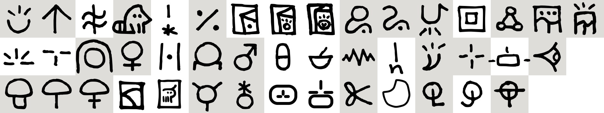
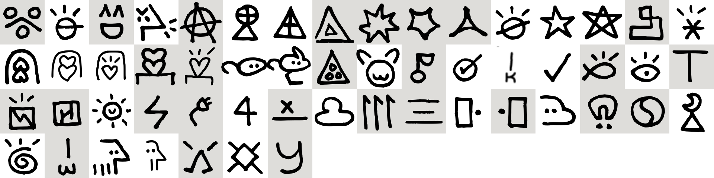
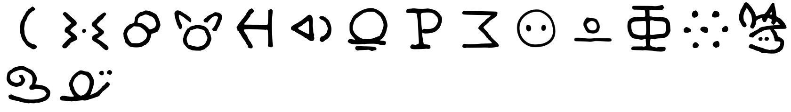
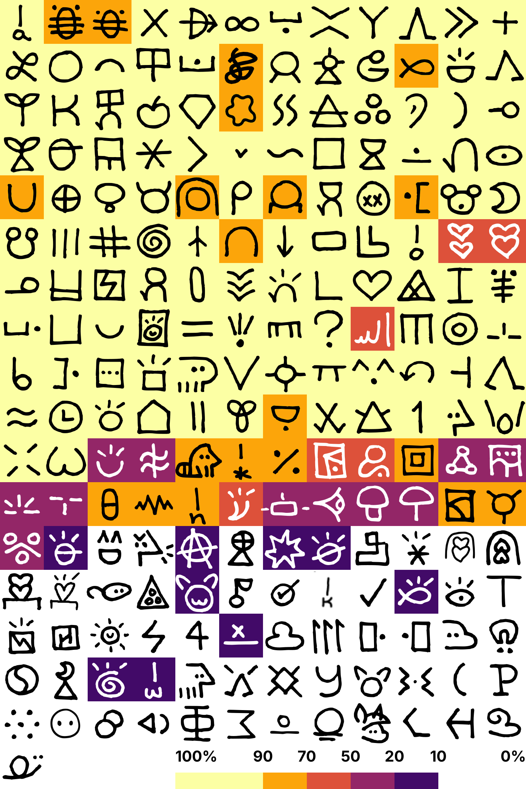

# Linku 2025 glyph survey (n=766)

### skippable core word glyphs

All glyphs here are their usual versions, no alternates.



`ala, alasa, ale, anpa, anu, awen, e, esun, iijo, ike, ilo, insa, jelo, jo, kalama, kama, kasi, ken, kepeken, kili, kiwen, kon, kule, kulupu, kute, la, laso, len, lete, li, lili, linja, lipu, loje, lon, luka, lukin, ma, mama, mani, mi, moku, musi, nanpa, nasa, nasin, nimi, noka, o, ona, open, pakala, pali, palisa, pan, pana, pi, pilin, pimeja, pini, pipi, poka, poki, pona, pu, sama, seli, selo, seme, sijelo, sike, sin, sina, sona, soweli, suli, suno, supa, suwi, tan, taso, tawa, telo, toki, tu, unpa, utala, walo, wan, waso, wawa, weka`

### unskippable core word glyphs

Each word here has at least one alternate. The ordering here is as it appeared in the survey, the ordering in the code block is according to when each glyph was coined.



```
a (1: straight, 2: slanted)
akesi (1: 6 legs, 2: 4 legs)
ante (1: X, 2: N)
jaki (1: nishiki-teki, chaotic; 1-copy: loopier; 2: zigzag; 2-copy: denser zigzag, thinner in the middle)
jan (1: without eyes, 2: with eyes)
kala (1: without eyes, 2: with eyes)
ko (1: assymetric blob, lesser-defined globs; 1-copy: 5 cusps; 1-copy-2: 5 more defined blobs)
lape (1: laying down; 2: face)
lawa (1: head with cap; 2: crown)
lupa (1: U; 2: U with ground)
moli (1: with circle, without mouth; 2: dead face)
monsi (1: dot behind, 2: linja behind)
mu (1: bear, 2: emitters)
mun (1: crescent moon, [kokosila-1]: non-intersecting pentagram, 2: intersecting pentagram)
mute (1: III, 2: 4 lukas)
nena (1: upside down U, 2: with ground)
ni (1: down, 2: right, 3: up, 4: left, 5: downright, 6: upright, 7: upleft, 8: downleft)
olin (1: split, 2: joined, 3: emitters)
sewi (1: religious, 2: secular)
sinpin (1: 1 dot in front, 2: one in front, one behind)
sitelen (1: 3 dots, 2: line [teken])
tenpo (1: analog clock, 2: hourglass)
tomo (1: without soffits, 2: with soffits)
uta (1: with dot, 2: without dot)
wile (1: W, 2: upside down pilin)
interpunct, colon
```

### common and uncommon word glyphs



```
epiku (1: pona with emitters, 2: up arrow)
jasima
kijetesantakalu
kin
kipisi
ku (1: dot, 2: toki, 3: toki pona)
lanpan (1: usual, closed head; 3: mistake, open head; 2: flipped pana)
leko
linluwi (1: len with emitters, 2: len with 3 dots, 3: 3 connected circles)
majuna (1: inverted sin; 2: lotus, 5 emitters)
meli (1: hair, 2: venus symbol)
meso
mije (1: shoulders, 2: mars symbol)
misikeke (1: pill, 2: mortar and pestle)
monsuta
n
namako (1: 4 emitters, 2: pepper)
nimisin
oko
soko (1: line stem; 2: mama-like, thick stem; 3: line with annulus)
su (1: yellow brick road, 2: unicorn)
tonsi (1: circle with 3 lines, 2: circle with asterisk)
nimi sin (scaled combination, stacked combination)
kipisi (3: scissors)
majuna (3: cut circle)
meli, mije, tonsi (3: circle with L, J and T)
```

### obscure word glyphs



```
apeja
isipin
jami
jonke
kamalawala
kapesi (1: prism with ma, 2: prism with cross inside)
kiki (1: explosion, 2: double triangle, 3: 3 point, 4: 5 point)
kokosila (1: non-intersecting pentagram, 2: toki with slash, [mun-2]: intersecting pentagram)
konwe
kulijo
melome (1: upside down olin, 2: right side up olin, 3: emitter olin)
mijomi (1: stacked olin, 2: emitter olin)
misa (1: no legs, no ears; 6: long ears, one leg)
mulapisu
nja
ojuta
oke (1: checkmark without circle, 2: check with circle, 3: ken with straight line)
omekapo
owe
pake
pakola (1: rotated pakala with emitters, 2: square with slanted H)
penpo
pika (1: bolt, 2: plug)
po
powe
puwa
san (1: 3 wans, 2: japanese)
teje
soto
sutopatikuna
taki (1: yin yang, 2: magnet)
unu
usawi
wa
wasoweli (1: 4 legs, 2: 2 legs)
wekama
wuwojiti
yupekosi
```

### sandbox word glyphs

All words here don't have any alternates either. kana and molusa were submitted 5+ times in the final question for additional glyphs.



`alu, eliki, kan, ki, kisa, lo, pa, pata, Pingo, ta, ka, lan, alente, likujo, poni, kana, molusa`

The highest scoring glyphs for each word (if within 5 percentage points, both appear here.)


